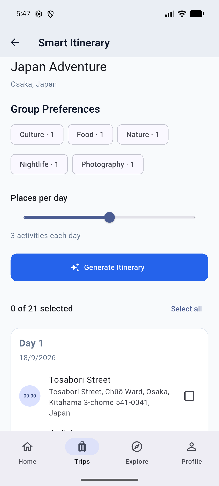

# 🌍 TripMate

TripMate is a Flutter mobile application for collaborative travel planning.  
Users can create trips, manage itineraries, discover places, split expenses, and generate smart itinerary suggestions based on group preferences.

---

## 🛠️ Tech Stack

- Flutter / Dart
- Riverpod
- GoRouter
- Firebase Authentication
- Cloud Firestore
- Dio
- Geoapify API
- flutter_map
- OpenStreetMap

---

## ✨ Features

- 🔐 Authentication and user profiles
- 🧳 Create and manage shared trips
- 👥 Add and remove trip members
- 📅 Multi-day itinerary management
- 🔎 Discover real-world places with Geoapify
- 🗺️ Interactive trip map
- ❤️ Favorite places
- 💰 Group expense splitting and settlement
- 📖 Travel journal
- 🧠 Smart itinerary recommendations based on group preferences
- ⏰ Duplicate and time-conflict prevention

---

## 📸 Screenshots

<p align="center">
  
  
  
</p>

<p align="center">
  <b>Home</b>
  &nbsp;&nbsp;&nbsp;&nbsp;&nbsp;&nbsp;&nbsp;&nbsp;&nbsp;&nbsp;&nbsp;&nbsp;
  <b>Trip Detail</b>
  &nbsp;&nbsp;&nbsp;&nbsp;&nbsp;&nbsp;&nbsp;&nbsp;&nbsp;
  <b>Smart Planner</b>
</p>

<p align="center">
  
  
  
</p>

<p align="center">
  <b>Explore</b>
  &nbsp;&nbsp;&nbsp;&nbsp;&nbsp;&nbsp;&nbsp;&nbsp;&nbsp;&nbsp;&nbsp;&nbsp;&nbsp;
  <b>Trip Map</b>
  &nbsp;&nbsp;&nbsp;&nbsp;&nbsp;&nbsp;&nbsp;&nbsp;&nbsp;&nbsp;
  <b>Expenses</b>
</p>

---

## ⚙️ Getting Started

### Prerequisites

- Flutter SDK
- Firebase project
- Geoapify API key

### Installation

```bash
git clone https://github.com/Traanminhquan/tripmate.git
cd tripmate
flutter pub get
```

Configure Firebase:

```bash
flutterfire configure
```

Run the application:

```bash
flutter run --dart-define=GEOAPIFY_API_KEY=YOUR_API_KEY
```

---

## 🧪 Testing

```bash
flutter test
```

---

## 📁 Architecture

```text
lib/
├── core/
├── data/
├── domain/
└── presentation/
```

The project follows a layered architecture inspired by Clean Architecture.

